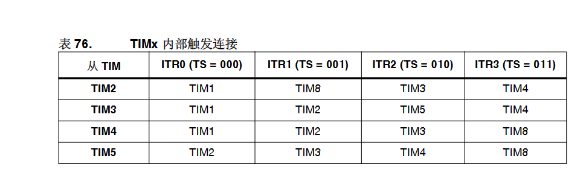
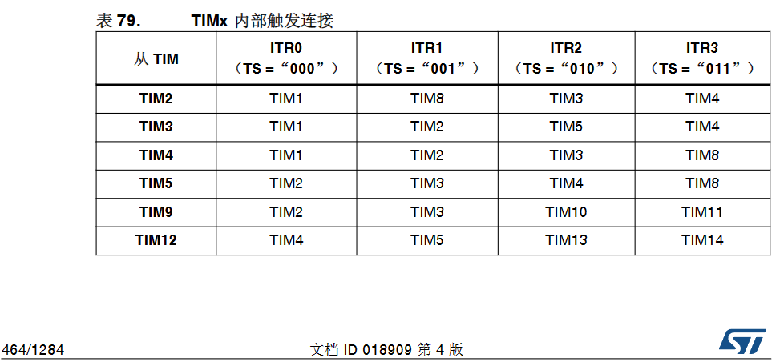

STM32F407ZGT6引脚定义

## 硬件信息

- 芯片型号：STM32F407ZG，晶振12MHz。
- 引脚信息

| 芯片引脚  | 实际作用           |
| --------- | ------------------ |
| I0        | PA0                |
| I1        | PA1                |
| I2        | PG8                |
| I3        | PB4                |
| I4        | PB5                |
| I5        | PG12               |
| I6        | PB6                |
| I7        | PB7                |
| I10       | PF10               |
| I11       | PA15               |
| I12       | PB3                |
| I13       | PA14               |
| Q0        | PF6  （TIM10_CH1） |
| Q1        | PF8    (TIM13_CH1) |
| Q2        | PF7    (TIM11_CH1) |
| Q3        | PF9    (TIM14_CH1) |
| USART1_TX | PA9                |
| USART1_RX | PA10               |

## PLC  I 和 Q的意义

一个输入I，一个输出Q

